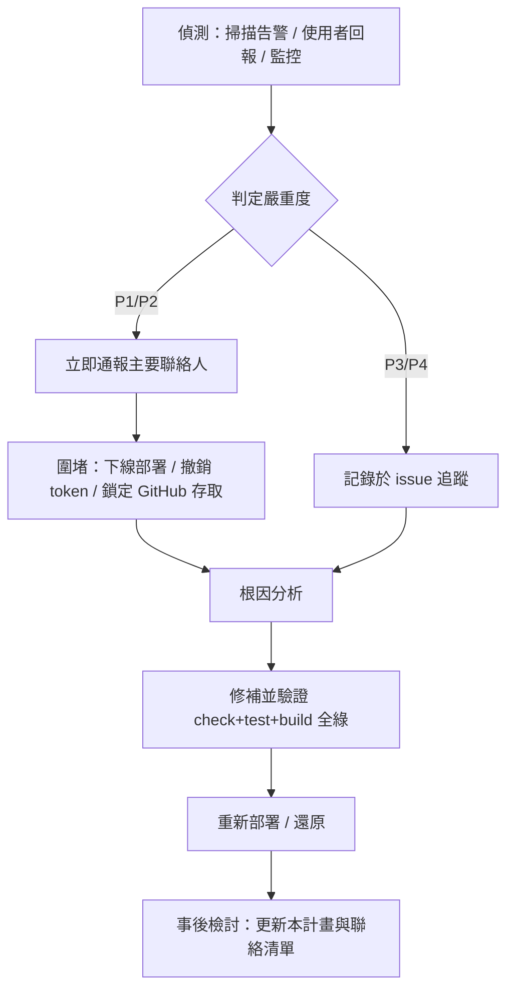

# 資安事件應變計畫與演練紀錄

> ISO/IEC 27001:2022 控制點 **A.5.24 — 資安事件管理規劃與準備**
> 對象系統：Smart Pedi 兒童發展評估（`https://smart-pedi-cds.yao.care`）
> 文件版本：1.0　建立日期：2026-06-10　負責人：{{pm_name}}（系統維運負責人）

## 1. 系統脈絡（決定本計畫範圍）

Smart Pedi 是**零後端、純瀏覽器端**的 SMART-on-FHIR 兒童發展臨床決策支援工具，部署於 GitHub Pages（自訂網域）。此架構直接決定了事件範圍：

- **病患／評估資料只存在使用者瀏覽器的 IndexedDB**，從不經過我方伺服器。因此「伺服器資料外洩」對病患個資的曝險為零；對應的資安資產是**原始碼 repo、GitHub Pages 部署、網域／DNS、相依套件供應鏈**。
- **FHIR 上傳兩條路徑**（醫院 standalone fhirclient、GCM 原生 PKCE）以 OAuth 將資料送往**外部** FHIR 伺服器；我方僅持有短期 access token，事件範圍涵蓋 token 洩漏與端點誤設。
- 無自有資料庫、無使用者帳號系統、無伺服器端 session。

## 2. 事件分類與嚴重度

| 等級 | 定義 | 範例 | 目標回應時間 |
|---|---|---|---|
| **P1 critical** | 使用者安全或病患資料直接受威脅 | GitHub 帳號遭盜用後推送惡意部署、相依套件供應鏈植入惡意碼（如 build 鏈 RCE）、網域／DNS 遭挾持 | 立即（≤ 1 小時內啟動） |
| **P2 high** | 安全機制失效但尚無確認濫用 | 前端 XSS 漏洞、FHIR token 洩漏、CSP 失效 | ≤ 4 小時 |
| **P3 medium** | 風險升高、無立即影響 | 相依套件已揭露 CVE（有修補）、設定偏移 | ≤ 3 工作天 |
| **P4 low** | 觀察事項 | 低信心掃描告警、誤報待確認 | 下次維護週期 |

## 3. 應變流程

詳細聯絡窗口見 [事件應變聯絡清單](incident-response-contacts.md)。

### 3.1 各情境圍堵手段（本架構特化）

- **惡意部署**：於 GitHub repo Settings 暫停 Pages 部署或還原至前一個已知良好 commit（見 [備份還原測試](backup-restore-test.md)）。
- **供應鏈／相依套件**：以 `pnpm.overrides` 鎖定安全版本（本 repo `package.json` 已有先例），重建並重新部署。
- **FHIR token 洩漏**：本系統不長期保存 token；通知對應 FHIR 主機方撤銷 client 註冊／旋轉密鑰。
- **DNS／網域挾持**：聯繫網域註冊商（{{domain_registrar}}）與 DNS 服務方還原紀錄。

## 4. 演練紀錄（A.5.24 要求：須留存演練證據）

> ⚠️ 以下為演練登記表。**實際演練須由負責人執行後填入真實日期與結果**，不得預先捏造。

| 演練日期 | 情境 | 參與者 | 結果摘要 | 發現／改進事項 |
|---|---|---|---|---|
| {{drill1_date}} | {{drill1_scenario}}（建議首場：模擬相依套件 RCE 供應鏈事件，對應本次 shell-quote CVE-2026-9277） | {{drill1_participants}} | {{drill1_result}} | {{drill1_findings}} |

**建議首次演練腳本（桌面推演，約 1 小時）**：假設掃描器回報某 build 相依套件存在可被 PR 觸發的 RCE → 依 §3 流程逐步演練「圍堵（暫停 CI/Pages）→ 鎖版（overrides）→ 驗證（check+test+build）→ 重新部署 → 檢討」，並記錄各步驟實際耗時與卡點。

## 5. 覆核

本計畫至少每 12 個月或重大架構變更後覆核一次。下次覆核日：{{next_review_date}}。
