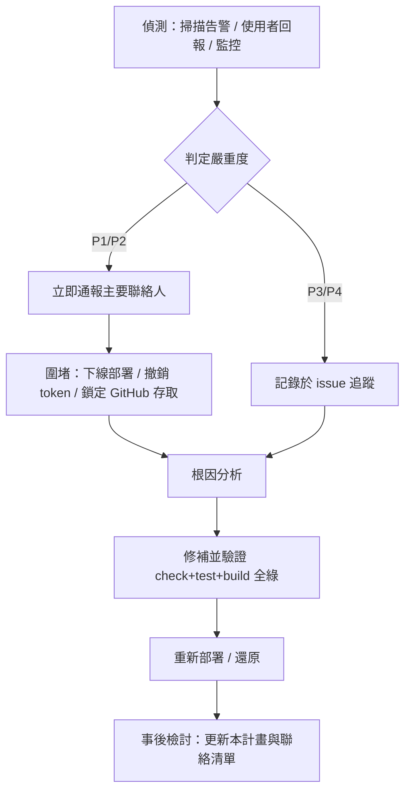

# 資安事件應變計畫與演練紀錄

> ISO/IEC 27001:2022 控制點 **A.5.24 — 資安事件管理規劃與準備**
> 對象系統：Smart Pedi 兒童發展評估（`https://smart-pedi-cds.yao.care`）
> 文件版本：1.0　建立日期：2026-06-10　負責人：系統維運負責人（藥提醒科技有限公司，單人維運）

## 1. 系統脈絡（決定本計畫範圍）

Smart Pedi 是**零後端、純瀏覽器端**的 SMART-on-FHIR 兒童發展臨床決策支援工具，部署於 GitHub Pages（自訂網域）。此架構直接決定了事件範圍：

- **病患／評估資料只存在使用者瀏覽器的 IndexedDB**，從不經過我方伺服器。因此「伺服器資料外洩」對病患個資的曝險為零；對應的資安資產是**原始碼 repo、GitHub Pages 部署、網域／DNS、相依套件供應鏈**。
- **FHIR 上傳兩條路徑**（醫院 standalone fhirclient、GCM 原生 PKCE）以 OAuth 將資料送往**外部** FHIR 伺服器；我方僅持有短期 access token，事件範圍涵蓋 token 洩漏與端點誤設。
- 無自有資料庫、無使用者帳號系統、無伺服器端 session。

## 2. 事件分類與嚴重度

| 等級 | 定義 | 範例 | 目標回應時間 |
|---|---|---|---|
| **P1 critical** | 使用者安全或病患資料直接受威脅 | GitHub 帳號遭盜用後推送惡意部署、相依套件供應鏈植入惡意碼（如 build 鏈 RCE）、網域／DNS 遭挾持 | 立即（≤ 1 小時內啟動） |
| **P2 high** | 安全機制失效但尚無確認濫用 | 前端 XSS 漏洞、FHIR token 洩漏、CSP 失效 | ≤ 4 小時 |
| **P3 medium** | 風險升高、無立即影響 | 相依套件已揭露 CVE（有修補）、設定偏移 | ≤ 3 工作天 |
| **P4 low** | 觀察事項 | 低信心掃描告警、誤報待確認 | 下次維護週期 |

## 3. 應變流程

詳細聯絡窗口見 [事件應變聯絡清單](incident-response-contacts.md)。

### 3.1 各情境圍堵手段（本架構特化）

- **惡意部署**：於 GitHub repo Settings 暫停 Pages 部署或還原至前一個已知良好 commit（見 [備份還原測試](backup-restore-test.md)）。
- **供應鏈／相依套件**：以 `pnpm.overrides` 鎖定安全版本（本 repo `package.json` 已有先例），重建並重新部署。
- **FHIR token 洩漏**：本系統不長期保存 token；通知對應 FHIR 主機方撤銷 client 註冊／旋轉密鑰。
- **DNS／網域挾持**：以網域登記人（藥提醒科技有限公司）帳號登入註冊服務商，與 DNS 服務方還原紀錄。

## 4. 演練紀錄（A.5.24 要求：須留存演練證據）

| 演練日期 | 情境 | 參與者 | 結果摘要 | 發現／改進事項 |
|---|---|---|---|---|
| 2026-06-10 | 桌面推演：build 相依套件供應鏈 RCE（shell-quote CVE-2026-9277） | 系統維運負責人 + Claude Code（推演引導） | 通過。依 §3 流程完成偵測→圍堵→修補→驗證→部署→檢討全週期 | 見 §4.1；已連同實際修補一併落地 |

### 4.1 第一次演練紀錄（2026-06-10，桌面推演）

**情境設定**：資安掃描（ID `20260610-044840-127e`）回報 build 工具鏈相依套件 `shell-quote@1.8.3` 存在可被 PR 標題／環境變數注入觸發的任意指令執行（critical）。本演練以此真實掃描結果為腳本，逐步走 §3 應變流程。此情境亦同步作為**真實修補**執行，故結果即為實測證據。

| 步驟（對應 §3） | 推演／實作內容 | 結果 |
|---|---|---|
| 偵測 | 外部資安掃描回報 critical | ✅ 來源確認 |
| 判定嚴重度 | 套件位於 build 鏈，CI 可被 PR 觸發 → 判 P1 | ✅ |
| 圍堵 | 確認 `shell-quote` 由 `fhirclient→expo→react-native` 帶入、無法移除 → 改以 `pnpm.overrides` 鎖安全版本 | ✅ override 機制可行 |
| 根因分析 | 追依賴鏈（`pnpm why`）確認非直接依賴、原始碼未呼叫 | ✅ |
| 修補並驗證 | 鎖版後 `pnpm check`(0 err) / `test`(676 passed) / `build`(exit 0, SEO 守門全過) / `lint`(0) | ✅ 驗證關卡全綠 |
| 重新部署 | commit `73b4a12` 推送 main → GitHub Pages 自動建置 | ✅ |
| 事後檢討 | 更新本計畫與聯絡清單 | ✅ |

**發現與改進事項（真實教訓）**：

1. **override 範圍陷阱**：首次以 `">=7.5.8"` 鎖 `protobufjs`，pnpm 解析到**跨大版本**的 8.6.2 並導致安裝失敗。改用 caret（`^7.5.8`）鎖在同一大版本後修復。
   → **改進**：所有間接依賴 override 一律用 caret，避免跨 major 破壞消費者。已落實於 `package.json`。
2. **缺自動化相依漏洞掃描**：本次 critical 由外部手動掃描發現，CI 無常態相依套件掃描。
   → **改進建議**：在 CI 加入定期 `pnpm audit` 或 Dependabot，縮短偵測延遲。（待辦）
3. **還原依賴 GitHub 可用性**：圍堵與部署皆透過 GitHub，若帳號失效則受阻。
   → **改進**：維持本機離線 clone 作獨立備份；見 [備份還原測試](backup-restore-test.md)。

**下次演練建議情境**：GitHub 帳號遭盜用後推送惡意部署（測試 §3.1「惡意部署」圍堵與 commit 還原能力）。

## 5. 覆核

本計畫至少每 12 個月或重大架構變更後覆核一次。下次覆核日：2027-06-10。
