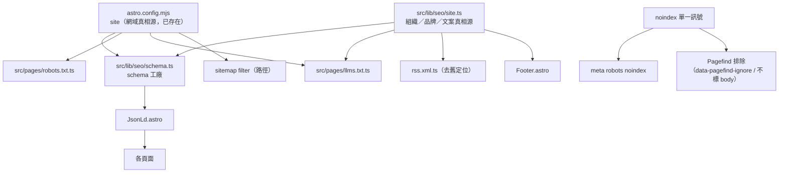

# SEO / AEO 基建設計

- **日期**: 2026-05-27
- **狀態**: 設計待核可（已整合第 1、2 輪獨立 Opus 審查）
- **範疇**: 技術基建 + 工具層文案（不含新增臨床內容、不需臨床審核）

---

## 1. 背景

稽核發現本站 technical SEO「骨架」已具備（Base.astro 的 title/description/canonical/OpenGraph/Twitter、`@astrojs/sitemap`、Breadcrumb 與 FAQPage JSON-LD、RSS），但有四類問題：

1. **P0 舊定位殘留（多檔同病）**：`public/llms.txt`、`public/llms-full.txt`、`src/pages/rss.xml.ts`、**`src/pages/about.astro`（meta + 正文）**、**`scripts/templates/manifest.template.json`（`name`/`short_name` 為 `CDSA`）** 仍含舊定位「CDSS 臨床決策／生命徵象監測／雙角色工作台／CDSA」、舊網址 `yao.care/smart-pedi-cds/`、GitHub repo 拼成 `yaocare`（實際 `yao-care`），且 about 把 CDSA 錯誤釋義為「臨床決策輔助應用」（實為兒童發展智慧評估）。
2. **P0 Pagefind 索引獨立於三層防護之外**：站內搜尋索引由 `postbuild` 的 `pagefind --site dist` 掃 `dist/` HTML 建成，**不看** meta-robots／robots.txt／sitemap。7 處 layout/頁面掛 `data-pagefind-body`（含 settings／history／admin／illustration-credits／assess），新增的 `/search` 會把工具/隱私頁當搜尋結果端給家長。
3. **P1 SEO 缺口**：無 `robots.txt`；工具/隱私頁無 `noindex`；衛教文章詳情頁**無可見 `<h1>`**（正文從 `##` 起跳）；主要 CTA 落點 `/assess` 是可索引頁卻 SSR 零文字、無 h1；衛教文章無 `MedicalWebPage`、列表頁無 `ItemList`；無自訂 `404`；首頁 FAQ 工程師導向。
4. **P2 加分項**：`og:image` 用方形 logo（非 1200×630）；缺 `Organization`/`WebSite`/`SoftwareApplication` schema；FAQPage 首頁與關於頁重複；RSS 無 autodiscovery link；Footer 含死連結與舊站名；`illustration-credits` 為 thin 頁卻可索引。

根因：**沒有站點層的單一真相源**，且 noindex／Pagefind 兩套索引邊界未對齊。

## 2. 目標與受眾決策

| 決策項 | 結論 |
|---|---|
| 主要受眾 | 家長為主、醫護為輔 |
| 對外核心定位 | 兒童發展評估（語言／動作／社交／認知里程碑） |
| 範疇深度 | 技術基建 + 工具層文案；**不**新增臨床內容、**不**需臨床審核 |
| 發行機構（Organization） | `yao.care 藥提醒科技` |
| 網站／應用程式名稱（WebSite／SoftwareApplication） | `Smart Pedi 兒童發展智慧評估` |
| og:image | 程式生成一張 1200×630 |

**成功標準**（可驗證）：
- Google Rich Results Test 對首頁與任一衛教文章驗證通過（Organization／FAQPage／MedicalWebPage 無錯誤）。
- 全站對外字串一致指向 `https://smart-pedi-cds.yao.care`，無 `yaocare`、無舊路徑；**可索引頁（首頁、about）的 meta 與可見正文無舊定位字串**（`臨床決策`、`生命徵象`、`CDSS` 作為產品主定位）。
- 不收錄頁（settings／admin／result／workspace／history／illustration-credits／search）：回傳 `noindex`、不出現在 sitemap、**不進 Pagefind 站內搜尋索引**。
- 衛教文章詳情頁有唯一 `<h1>`（=標題）+ `MedicalWebPage` schema（含標題/摘要/年齡/發行者/發佈/修改日期）；`/assess` 頁有 SSR 可見 `<h1>` 與引導文字。
- `/education/` 列表頁帶 `ItemList`／`CollectionPage` schema；存在自訂 `404`（noindex）。
- 守門測試通過（見 §7）。

## 3. 架構：單一真相源 + 兩套索引邊界對齊



**真相源分工**：網域 URL 由 `astro.config` 的 `site` 定義；組織/品牌/文案放 `src/lib/seo/site.ts`，由 schema、llms.txt、rss.xml.ts、Footer 共用。
**索引邊界對齊**：`noindex` 單一訊號同時驅動 meta-robots 與 Pagefind 排除；sitemap 用路徑 filter；三者目標清單一致（§6）。

## 4. 新增檔案

### 4.1 品牌字串真相源：`scripts/base.mjs` + `src/lib/seo/site.ts`
品牌字串需同時供 build script（`.mjs`，如 manifest 注入）與 runtime（`.ts`，schema/layout）使用。已驗證 `build-manifest.mjs` 是純 Node `.mjs`、用佔位符 `.replace()` 機制且 `import ... from './base.mjs'`——它**無法**反向 import `.ts`。但 `.ts` 可 import `.mjs`。故**品牌字串集中在既有的 `scripts/base.mjs`**（已是 `BASE_PATH`/`THEME_COLOR` 真相源），`site.ts` 匯入後組成 `SITE`：

```js
// scripts/base.mjs（既有檔，新增品牌常數）
export const SITE_NAME = 'Smart Pedi 兒童發展智慧評估';
export const SITE_SHORT_NAME = 'Smart Pedi';
export const SITE_TAGLINE = '給 0–6 歲家長的免費兒童發展篩檢工具';
export const SITE_DESCRIPTION = '在瀏覽器完成的兒童發展評估，依年齡評估語言、動作、社交、認知等發展里程碑，並提供對應衛教內容。結果非醫療診斷，發現疑慮建議就醫評估。';
```

```ts
// src/lib/seo/site.ts
import { SITE_NAME, SITE_SHORT_NAME, SITE_TAGLINE, SITE_DESCRIPTION } from '../../../scripts/base.mjs';
export const SITE = {
  name: SITE_NAME, shortName: SITE_SHORT_NAME, tagline: SITE_TAGLINE, description: SITE_DESCRIPTION,
  inLanguage: 'zh-TW',
  logoPath: '/icons/icon-512.png',
  ogImagePath: '/og/og-default.png',
  organization: { name: 'yao.care 藥提醒科技', legalName: 'yao.care 藥提醒科技', url: 'https://yao.care' },
  repo: 'https://github.com/yao-care/smart-pedi-cds',
  sameAs: [] as string[], // 留空則 schema 省略此欄，不輸出空陣列
} as const;
```
> 單一真相源在 `base.mjs`，manifest（build 期）與 schema/layout（runtime）共用同一份品牌字串，根除不一致。

### 4.2 `src/lib/seo/schema.ts`
工廠函式（接受 `site: URL` 組絕對 URL）：
- `organizationSchema(site)` → `Organization`（name/url/logo，sameAs 非空才加）。
- `webSiteSchema(site)` → `WebSite`（name/url/inLanguage/publisher，含 `potentialAction: SearchAction` target=`{site}/search?q={search_term_string}`，搭配 §4.8）。
- `softwareApplicationSchema(site)` → `SoftwareApplication`（applicationCategory=`HealthApplication`、operatingSystem=`Web`、offers price=0、isAccessibleForFree=true）。
- `medicalWebPageSchema(site, { title, summary, ageGroups, url, publishedAt, updatedAt })` → `MedicalWebPage`（about、audience=`MedicalAudience(Parent)`、`specialty: 'Pediatrics'`、inLanguage、isPartOf→WebSite、publisher→Organization、datePublished=publishedAt、明確輸出 `dateModified`=`lastReviewed`=updatedAt ?? publishedAt）。
- `articleListSchema(site, articles)` → `ItemList`（列表頁，ListItem position/name/url）。
- `breadcrumbSchema(items)` → `BreadcrumbList`。
- `faqPageSchema(faqs)` → `FAQPage`。

### 4.3 `src/components/seo/JsonLd.astro`
通用 `<JsonLd data={...} />`：`<script type="application/ld+json" set:html={JSON.stringify(data)} />`，取代散落 inline script。

### 4.4 `src/pages/robots.txt.ts`
endpoint 回 `text/plain`，用 `context.site` 組 sitemap 網址：
```
User-agent: *
Allow: /
Disallow: /settings
Disallow: /admin
Disallow: /result
Disallow: /workspace
Disallow: /history

Sitemap: https://smart-pedi-cds.yao.care/sitemap-index.xml
```
> `/search`、`/about/illustration-credits`、`/404` **不** Disallow（靠 noindex），避免擋掉 search 運作與內部連結爬取。

### 4.5 `src/pages/llms.txt.ts`
endpoint 回 `text/plain`，依 [llms.txt 規範](https://llmstxt.org/)，由 `SITE` + education collection 投影：
```
# Smart Pedi 兒童發展智慧評估

> 給 0–6 歲家長的免費兒童發展篩檢工具，在瀏覽器完成、不上傳個資。
> 評估語言、動作、社交、認知等發展里程碑，並提供對應衛教內容。

## 這是什麼
- 家長可自行操作的兒童發展評估，依年齡給適齡題目
- 結果非醫療診斷，發現疑慮建議就醫評估
- 由 yao.care 藥提醒科技開發，開源、純瀏覽器、零個資上傳

## 衛教主題
（每篇： - [標題](絕對URL): 摘要）

## 開始評估
- [家長評估入口](https://smart-pedi-cds.yao.care/assess)
- [衛教內容](https://smart-pedi-cds.yao.care/education/)
- [內容更新 RSS](https://smart-pedi-cds.yao.care/rss.xml)

## 原始碼
https://github.com/yao-care/smart-pedi-cds
```
> 取代並移除 `public/llms.txt`、`public/llms-full.txt`。

### 4.6 og 圖生成腳本 `scripts/generate-og-image.mjs`
- 輸出 `public/og/og-default.png`（1200×630）；新增 npm script `generate:og`。
- 中文標題以 `opentype.js` 轉 SVG path（重用 `public/fonts` Noto Sans TC subset）→ sharp 轉 PNG（與既有管線一致）；缺字 fallback `satori`+`@resvg/resvg-js`。
- 視覺：品牌綠底 `#3d6b54`、cream 文字、站名 + tagline。

### 4.7 `src/pages/404.astro`
用 `App` layout，傳 `noindex`；友善訊息 + 導回連結（首頁／`/assess`／`/education/`）。

### 4.8 `src/pages/search.astro`
掛現有 Pagefind `PagefindUI`，讀 `?q=` 帶入查詢；傳 `noindex`（亦不進 Pagefind 自身索引，見 §5.12），但**不** robots Disallow（需可運作）。對應 §4.2 `webSiteSchema` 的 SearchAction。

## 5. 修改檔案

### 5.1 `src/layouts/Base.astro`
- 新增 `noindex?: boolean` prop；真時輸出 `<meta name="robots" content="noindex, nofollow" />`。
- `og:image` 改 `SITE.ogImagePath`（1200×630），補 `og:image:width/height/alt`、`og:site_name`。
- 補 RSS autodiscovery：`<link rel="alternate" type="application/rss+xml" title="衛教內容" href={new URL('/rss.xml', Astro.site).href} />`。
- 補 `<meta name="author" content={SITE.organization.name} />` 與 `<meta name="application-name" content={SITE.shortName} />`（低成本 head 信號，與 §5.14 manifest 品牌統一）。
- `fullTitle` 後綴硬編碼的 `兒童發展智慧評估` → 改用 `SITE.shortName`/`SITE.name`，與 og:site_name、schema、manifest 品牌一致（`<title>` 是最強 on-page 訊號）。

### 5.2 `src/pages/index.astro`
注入 `organizationSchema` + `webSiteSchema` + `softwareApplicationSchema` + `faqPageSchema`。FAQPage 僅放首頁。

### 5.3 `src/pages/about.astro`（去舊定位，改家長/發展評估口吻）
- meta `description` 改吃 `SITE.description`（取代「兒科健康評估與臨床決策輔助系統使用說明」）。
- **可見正文/標題改寫**：移除「雙角色／CDSS 工作台即時監測指標、接收預警／生命徵象」等舊臨床主定位敘事，改以兒童發展評估、家長使用情境為主軸；修正 CDSA 釋義為「兒童發展智慧評估」。屬工具層既有功能描述，不新增臨床主張。（醫護工作台若保留，僅作簡短次要提及，不作為頁面主定位。）
- **「臨床決策流程」section 改名**：`about.astro` line 66 `aria-label="臨床決策流程"`、line 67 `<h2>臨床決策流程</h2>`、line 201 CSS 註解，描述的是 CDSA 評估自身的判讀邏輯（年齡→施測→計分→三級分流→衛教），但「臨床決策」對家長頁仍是不當術語。一併改為家長導向用語（如「評估判讀流程」）。**此舉同時消解 §7 掃描矛盾**：§7 對 about 可見正文斷言「不含 `臨床決策`」，若不改此標題則測試會誤殺合法內容而失敗。
- 移除 FAQPage（去重），注入 `organizationSchema`。

### 5.4 `src/pages/education/[...slug].astro`
- 加可見 `<h1>{entry.data.title}</h1>`（置 `.content-meta` 前；已驗證正文皆 `##` 起跳，無重複）。
- 注入 `medicalWebPageSchema`（資料來自 `entry.data` + 當前 URL）。
- Breadcrumb 改用 `breadcrumbSchema` + `JsonLd`。

### 5.5 `src/pages/education/index.astro`（矩陣式列表頁）
此頁實為「年齡×領域」矩陣，文章連結埋在預設折疊的 `<details>` 內、混雜編輯/刪除按鈕；已有 `<h1>衛教資源</h1>`。
- 注入 `articleListSchema`，`itemListElement` **直接由 `getCollection('education')` 投影**（每篇 name + 絕對 url），不從矩陣 cell 推導（避免漏列/重複、與 schema 脫節）。
- 在矩陣上方或下方補一段**常駐可見、非折疊**的「所有衛教文章」`<ul>`（純連結清單），改善家長探索與內部連結曝光（折疊內連結對爬蟲與 UX 較不利）。

### 5.6 `src/pages/assess.astro`（補 SSR 可索引內容）
在 `<main>` 內、island 之前加 SSR 可見 `<h1>`（如「兒童發展評估」）+ 一段引導/說明文字（島仍 `client:load` 接管下方互動）。屬工具層文案。

### 5.7 `src/data/site-faqs.ts`（FAQ 改寫為家長/工具層）
1. 這個評估是做什麼的？評估孩子哪些發展面向？
2. 評估結果可以取代醫師診斷嗎？（明確：非診斷、有疑慮就醫）
3. 我和孩子的資料會被上傳嗎？（純瀏覽器、不上傳）
4. 需要費用、登入或預約嗎？（免費、免登入、免安裝）
5. 評估完發現疑慮，下一步該怎麼辦？（看衛教、必要時就醫）

`faqJsonLd` 邏輯搬到 `schema.ts` 的 `faqPageSchema`；`site-faqs.ts` 只留資料。

### 5.8 `src/components/blocks/Breadcrumb.astro`
inline JSON-LD 改用 `breadcrumbSchema` + `<JsonLd>`。

### 5.9 `src/pages/rss.xml.ts`
`title` → `${SITE.name} — 衛教內容`、`description` → `SITE.description`（去舊「CDSS 兒科臨床決策輔助系統」）。納入 §7 守門掃描。

### 5.10 `src/components/blocks/Footer.astro`（每個可索引頁都會渲染）
- GitHub `href="#"`（line 14）→ `SITE.repo`。
- copyright `CDSS 兒科臨床決策輔助系統`（line 8）→ `SITE.name`/`SITE.shortName`。
- **移除/改寫 `Powered by SMART on FHIR`（line 12）**——對家長無意義且強化臨床/EHR 舊框架；改為中性文案（如「開源・純瀏覽器」）或刪除。
- 因 Footer 隨每個可索引頁渲染，納入 §7 positioning 守門掃描。

### 5.11 `astro.config.mjs`（sitemap 正式設定）
`sitemap({ filter, serialize })`：
- `filter`：排除 `/settings`、`/admin`、`/result`、`/workspace`、`/history`、`/search`、`/about/illustration-credits`、`/404`。
- `serialize`：education 文章頁帶 `lastmod`（路徑對應 collection `updatedAt ?? publishedAt`）。

### 5.12 Pagefind 索引邊界（與 noindex 對齊）— **新增關鍵變更**
Pagefind 索引不受 meta-robots/robots/sitemap 影響，須獨立排除。規則：**凡 `noindex` 頁，一律不進 Pagefind 索引**。
- 已驗證掛 `data-pagefind-body` 之處：layout `App`／`Education`／`Assess` 的 `<main>`，及頁面 `assess.astro`（**直接用 Base** + 自寫 `<main>`）／`history.astro`／`illustration-credits`／`admin/card-review` 自寫的 `<main>`。`Workspace.astro` body 是 `.workspace-body` div、**本就無 `data-pagefind-body`**（workspace 早已不在站內搜尋），僅需補 noindex meta。
- 作法：當該頁 `noindex` 為真時，對應 `<main>` **不標 `data-pagefind-body`、改標 `data-pagefind-ignore`**，以 `noindex` prop 統一驅動。
- 受影響：`settings`(App)、`history`、`admin/card-review`、`about/illustration-credits`、`result`、`search`（workspace 無需處理，本就排除）。
- 保留索引：`/`、`about`、education 文章與列表、`assess`（§5.6 補 SSR 內容後具搜尋價值）。

### 5.13 加 `noindex` 的頁面（所有 layout 皆 wrap `Base.astro`，已驗證）
noindex prop 加在 `Base.astro`，中介 layout 轉傳並同步控制 §5.12 的 Pagefind 屬性：

| 頁面 | layout | 作法 |
|---|---|---|
| `history` / `result` / `admin/*` / `about/illustration-credits` | Base（直接） | 直接傳 `noindex` |
| `404` / `search` | App（或 Base） | 傳 `noindex` |
| `settings` | App → Base | `App.astro` 加 `noindex` prop，轉傳 Base + 控 main pagefind |
| `workspace/*` | Workspace → Base | `Workspace.astro` 加 `noindex` prop，轉傳 Base + 控 main pagefind |

> `Education.astro`／`Assess.astro` 對應頁面需被收錄，不傳 noindex。

### 5.14 `scripts/templates/manifest.template.json` + `scripts/build-manifest.mjs`（去舊品牌）
- template 的 `name`（現 `CDSA 兒童發展智慧評估`）、`short_name`（現 `CDSA`）、`description` 改為佔位符 `__NAME__`/`__SHORT_NAME__`/`__DESCRIPTION__`（沿用既有 `__BASE_PATH__`/`__THEME_COLOR__` 機制）。
- `build-manifest.mjs` 已 `import { BASE_PATH, THEME_COLOR } from './base.mjs'`；再 import §4.1 新增的 `SITE_NAME`/`SITE_SHORT_NAME`/`SITE_DESCRIPTION` 並 `.replace()` 注入。
- 品牌真相源在 `base.mjs`（§4.1），與 runtime `SITE` 共用，根除 manifest 與 schema 名稱不一致。Google 讀 manifest `name`/`short_name` 作 PWA 安裝名與品牌信號。
- 納入 §7 守門掃描。

### 5.15 `src/components/blocks/Header.astro`（主導覽與 noindex 對齊）
- `navLinks` 目前含「評估紀錄 `/history/`」——一個 noindex + Disallow 頁，卻出現在每個可索引頁的主導覽，稀釋內部連結權重並導向空的私人工具頁。**建議**：將 `/history/` 自全域主導覽移除或下放（如移至 footer，或僅在評估結果脈絡內出現），主導覽只留對外可索引內容（衛教資源／關於／開始評估）。
- `site-title` 文案 `兒童發展智慧評估` 可一併對齊 `SITE.name`/`SITE.shortName`（品牌一致；非舊定位，屬加分）。
- **此為 UX/SEO 權衡，文案與導覽結構於 review gate 與用戶確認後定案。**

## 6. 索引邊界總表（三套機制對齊）

| 路徑 | meta noindex | robots Disallow | Pagefind | sitemap | 理由 |
|---|---|---|---|---|---|
| `/settings` | ✓ | ✓ | 排除 | 排除 | 工具設定 |
| `/admin/*` | ✓ | ✓ | 排除 | 排除 | 管理 |
| `/result` | ✓ | ✓ | 排除 | 排除 | 含個資 |
| `/workspace/*` | ✓ | ✓ | 排除 | 排除 | 需登入/含個資 |
| `/history` | ✓ | ✓ | 排除 | 排除 | 含個資 |
| `/about/illustration-credits` | ✓ | ✗ | 排除 | 排除 | thin 頁，保留可連結 |
| `/search` | ✓ | ✗ | 排除 | 排除 | 搜尋頁，需可運作 |
| `/404` | ✓ | ✗ | 排除 | 排除 | 錯誤頁 |
| `/`、`/about`、`/assess`、`/education/*` | — | — | 索引 | 收錄 | 對外可索引內容 |

## 7. 測試策略

`tests/seo/`（vitest）：
- **`schema.test.ts`**：各工廠必要欄位（`@context`/`@type`、Organization.name、WebSite.potentialAction、MedicalWebPage.audience/datePublished、ItemList.itemListElement），`JSON.stringify` 不丟例外。
- **`positioning.test.ts`**（合併 url 一致性 + 舊定位）：掃 `scripts/base.mjs`、`site.ts`、`llms.txt` 產出、`rss.xml.ts`、`scripts/templates/manifest.template.json`（或 `dist/manifest.json`）、**`src/components/blocks/Footer.astro`（隨每頁渲染）**，以及**可索引頁 `index.astro`／`about.astro` 的 meta description 與可見正文**，斷言不含 `yaocare`、舊路徑 `yao.care/smart-pedi-cds`、舊定位主字串（`臨床決策`、`生命徵象`、`SMART on FHIR`）、舊品牌 `CDSA`／`CDSS`（作為產品名）；`SITE.repo` 含 `yao-care`；manifest `name`/`short_name` 等於 `SITE.name`/`SITE.shortName`。
- **`h1.test.ts`**：衛教文章頁與 `/assess` 頁渲染輸出含唯一 `<h1>`。
- **建置後檢查**：`dist/robots.txt`（含 `Sitemap:`）、`dist/llms.txt`（網域正確）、`dist/sitemap-0.xml`（不含 noindex 路徑）、`dist/404.html` 存在；**Pagefind 排除**：noindex 頁的 `dist` HTML 不含 `data-pagefind-body`（含 `data-pagefind-ignore` 或無 body 標記）。
- **noindex 覆蓋**：§6 不收錄頁輸出含 `noindex`。

## 8. 不在本次範疇（YAGNI / 日後 cycle）

- 新增／改寫衛教臨床內容、臨床問答（內容深化 cycle）。
- 擴充 `content.config.ts` frontmatter（author／reviewedBy 等）。**附記**：屆時「文章互連／延伸閱讀」可用既有 `category`+`ageGroup` 做零 frontmatter 自動同類關聯（第 1 輪 #12）。
- `llms-full.txt` 詳細版 endpoint（先刪過時靜態檔）。
- 多語言 hreflang（已決議不做 i18n）。
- **Lighthouse CI 覆蓋可索引頁**（第 1 輪 #11）：現只測 `/result/`、`/workspace/result/`（noindex 工具頁）；建議下一輪加 `/`、`/about`、一篇 education 文章 + `categories:seo/accessibility` 斷言。屬 CI/營運基建。
- Google Search Console／排名追蹤（營運層）。

## 9. 風險與緩解

| 風險 | 緩解 |
|---|---|
| Pagefind 索引獨立於 meta-robots/robots/sitemap | §5.12 以 `noindex` 單一訊號驅動 Pagefind 排除，§7 守門檢查 |
| OG 圖中文渲染（sharp+SVG text 不可靠） | opentype.js text-to-path（Noto Sans TC），fallback satori |
| sitemap 仍收錄 noindex 頁 | §5.11 `filter` 排除，三機制對齊（§6） |
| `search` 被 noindex 又 Disallow 致 SearchAction 失效 | search 僅 noindex、不 Disallow（§4.4/§6） |
| about 改寫誤刪真實醫護功能描述 | 醫護工作台保留為次要簡述；主定位改家長/發展評估；文案方向於 review gate 與用戶確認 |
| 文章頁加 h1 與正文重複 | 已驗證 19 篇正文皆 `##` 起跳，無自帶 h1 |
| Astro frontmatter 讀 `import.meta.env` 觸發 esbuild 雷 | endpoint/schema 經 `Astro.site`，常數放獨立 `.ts`，不在 layout frontmatter 做字串正則 |
| 自訂域名 DNS 未生效 | URL 真相源為 `astro.config` `site`，與 DNS 解耦；不改 `site` 值 |
