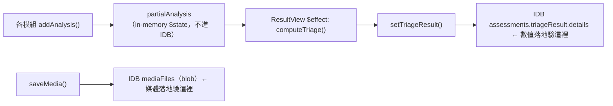
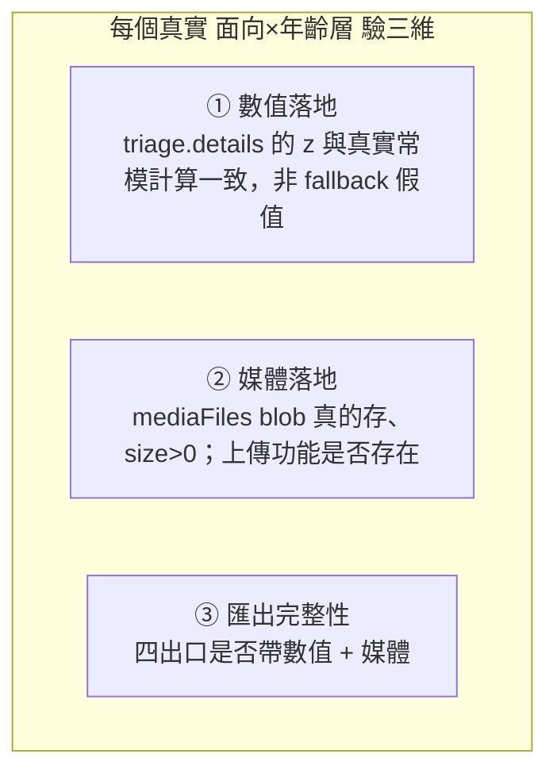
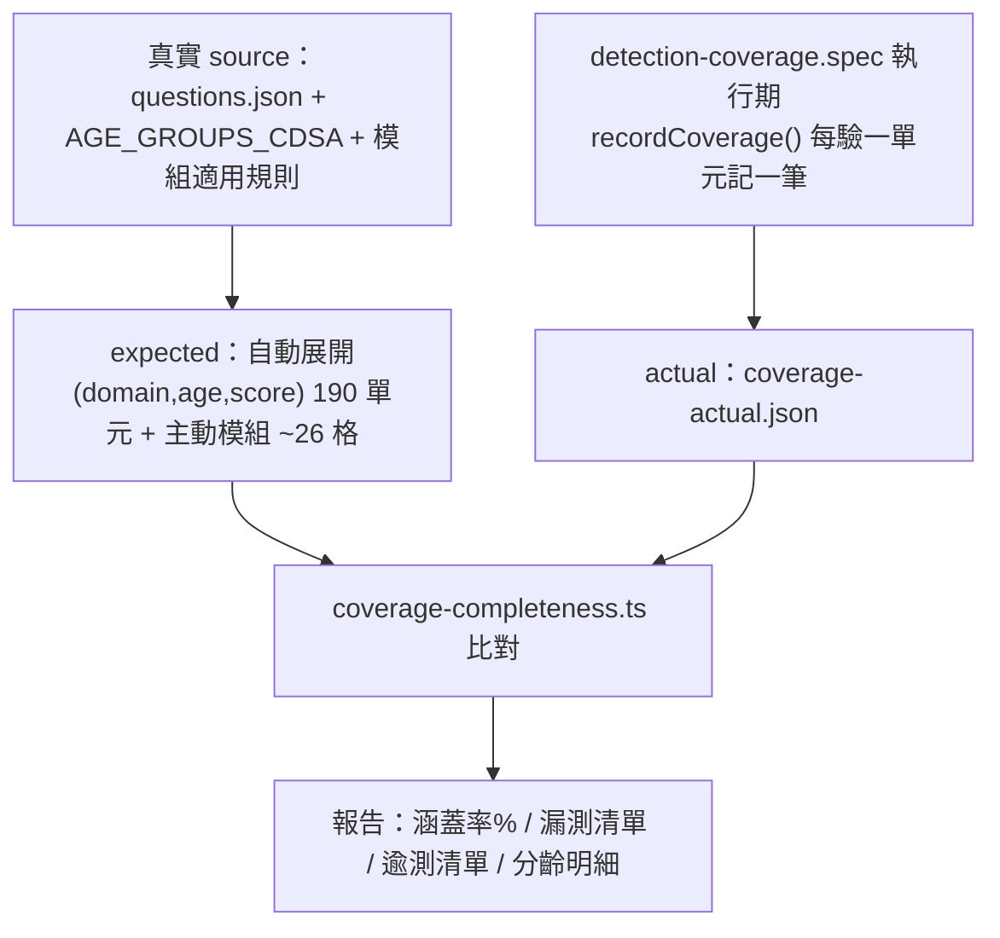

# 檢測覆蓋 E2E 測試設計（6 面向 × 7 年齡層）

- **日期**：2026-07-07
- **狀態**：設計定案，待實作計畫（writing-plans）
- **範圍**：第一階段——測試腳本 + 缺口報告（不含缺口修復）

## 1. 背景與問題

專案抱怨：「不同年齡層的檢測沒有落實開發」。經逐檔盤點，問題屬實且比預期嚴重——主動互動檢測模組多數未把數值接進評估管線，且錄製的媒體（音檔/影片）無任何匯出出口。

本專案需要一支**資料驅動**的 E2E 測試腳本，對每個「面向 × 年齡層」實際餵真實資料跑完評估，並在瀏覽器端（IndexedDB）驗證檢測數值是否正確落地；跑完輸出一張缺口矩陣，作為第二階段修復的依據。

**設計紀律**：測試的輸入與期望值一律源自專案真實資料與真實評分管線，不使用人工假設的情境（曾提出的「三情境」已因違反此紀律而收回）。

## 2. 目標與非目標

### 目標
1. 一支可重複執行的 Playwright E2E：`tests/e2e/detection-coverage.spec.ts` + helpers。
2. 一張三維度缺口矩陣報告（數值落地 / 媒體落地 / 匯出完整性）。
3. 一支測試完整性稽核腳本：`tests/e2e/coverage-completeness.ts`，從真實 source of truth 反推「應測清單」，稽核測試有無漏測。

### 非目標（留第二階段）
- 修復任何缺口（Video/Voice 接線、voice 上傳、媒體進匯出等）。
- 驗證主動模組的**感測演算法準度**（如 Meyda 算的 pitch 是否正確）；本階段只驗「數值是否正確落地」。

## 3. 關鍵決策（已與需求方逐項確認）

| # | 決策 | 選定 |
|---|------|------|
| D1 | 執行層級 | 真瀏覽器 E2E（Playwright）+ 注入主動資料 |
| D2 | 測試目標 | live URL `https://smart-pedi-cds.yao.care/`（env 切換，不動既有本機測試） |
| D3 | 正確性判準 | 情境因果 + 結構正確 → 細化為「真實資料驅動枚舉 + 真實常模 golden」 |
| D4 | 交付邊界 | 兩階段；本次交付測試 + 報告 |
| D5 | 驗證維度 | 三維：①數值落地 ②媒體落地 ③匯出完整性（四出口） |
| D6 | 枚舉粒度 | 全枚舉每個真實分數點 |
| D7 | 完整性稽核 | 從真實 source 反推應測清單，自動找漏測 |

## 4. 真實情況（實作與斷言的依據，全部經 code 查證）

### 4.1 資料落地路徑



- DB 名稱：`cdss-pediatric`（Dexie，目前 v7）。
- **數值最終落地點** = `assessments.triageResult.details[]`，每筆 `{domain, metric, value, zScore, directionalZ, isAnomaly, maxScore, normMean, normStd}`。寫入時機在 result 頁 `ResultView.svelte` 的 `saveResult()` → `setTriageResult()`。
- **媒體落地點** = `mediaFiles` 表（`fileType: 'voice' | 'video' | 'drawing'`）。

### 4.2 模組 addAnalysis 接線真相（決定「數值落地」缺口）

| 模組 | 是否 addAnalysis | 進 triage 的 domain / metric |
|------|:---:|------|
| QuestionnaireModule | ✅ | 6 個問卷 domain，`metric: questionnaireScore` |
| GameModule | ✅ | `behavior`（4 指標：completionRate / operationConsistency / reactionLatency / interactionRhythm） |
| DrawingModule | ✅（已修） | `fine_motor`，`metric: drawingScore`（需 `shapes.length > 0`） |
| VoiceModule | ❌ **斷鏈** | 應為 `language`，`metric: voiceDuration`（需 `voiceDurationTotal > 0`）——但從不 addAnalysis |
| VideoModule | ❌ **斷鏈** | 應為 `gross_motor`，`metric: poseClassification`——但只 saveMedia，從不 addAnalysis |

### 4.3 domain 命名不統一（真實問題，非測試造成）

`triage.details` 的 domain key 空間混雜達 8 種：問卷用 `cognition / fine_motor / gross_motor / language_comprehension / language_expression / social_emotional`；Game 用 `behavior`；Voice 用 `language`（**與問卷語言兩 domain 不同 key、per-domain z 合成時不會合併**）；Drawing 用 `fine_motor`（與問卷 fine_motor 合成）；Video/grossMotor 用 `gross_motor`（與問卷合成）。此不一致本身可能是設計缺陷，測試應如實記錄，修正留第二階段。

### 4.4 真實問卷空間（可完全枚舉）

每題選項固定 `2/1/0`；每個 (domain×年齡層) 的 maxScore = 題數 × 2。**真實有題格子 = 40**（下表非「無題」者）。

| maxScore | 2-6m | 7-12m | 13-24m | 25-36m | 37-48m | 49-60m | 61-72m |
|---|---|---|---|---|---|---|---|
| gross_motor | 4 | 4 | 4 | 4 | 4 | 4 | 4 |
| fine_motor | 2 | 4 | 4 | 4 | 4 | 4 | 4 |
| language_comprehension | 2 | 4 | 4 | 4 | 4 | 4 | 4 |
| language_expression | 無題 | 2 | 4 | 4 | 4 | 4 | 4 |
| cognition | 無題 | 2 | 4 | 4 | 4 | 4 | 4 |
| social_emotional | 2 | 4 | 4 | 4 | 4 | 4 | 4 |

- maxScore=4 → 可能總分 `{0,1,2,3,4}`（5 點）；maxScore=2 → `{0,1,2}`（3 點）。
- 2-6m 的 `language_expression`／`cognition` 無題屬 ASQ-3 臨床設計，矩陣標 `N/A`，非缺口。

### 4.5 真實常模與 gating（golden 的真實來源）

- `getQuestionnaireNorm(domain, ageGroup, maxScore)`：借用 ASQ-3 Table 18（`asq3-table18-raw.json`），滿分縮放 `mean_local = mean_asq × maxScore / 60`、`sd_local = sd_asq × maxScore / 60`。
- 單格 z：`z = (score − mean_local) / sd_local`，`directionalZ = z`（負 = 比常模差）。
- per-domain 合成：`domainLevelZ[domain] = mean(該 domain 所有 details 的 directionalZ)`。
- 分級：`domainLevelZ ≤ -2 → refer`；`≤ -1 → monitor`；否則 `normal`。整體 category：任一 domain refer → refer；否則任一 monitor → monitor；否則 normal。
- **測試 golden 由此真實管線在測試端獨立計算**（同一組公式與常模資料），比對 IDB 實際存值，不使用人工假設。

### 4.6 四個匯出出口現況（決定「匯出完整性」缺口）

| 出口 | 含數值 | 含媒體 | 依據 |
|------|:---:|:---:|------|
| PDF 報告（AssessmentPdfReport） | ✅ | ❌ | 報告產生器零 media 處理 |
| FHIR 上傳（cdsa-submit） | ✅ | ❌ | 只送 Observation + DiagnosticReport |
| GCM Bundle（gcm-submit） | ✅ | ❌ | 只 QuestionnaireResponse + Observation + DiagnosticReport |
| 歷史下載包 | ❌ | ❌ | **功能不存在** |

## 5. 測試架構

### 5.1 三驗證維度 × 資料驅動



### 5.2 測試輸入策略：資料驅動全枚舉

- **問卷維度（維度①核心）**：對每個真實有題的 (domain×age)，全枚舉其可能總分 `0..maxScore`。因各 domain 計分獨立，一次評估可讓不同 domain 取不同分數；以「每齡跑 max(分數點數)=5 次評估、對每 domain 錯開分數點」覆蓋全枚舉，7 齡約 35 次問卷評估（實作最佳化細節交 writing-plans）。
- 每個分數點：測試端用 §4.5 真實常模獨立算期望 z 與 domainCategory，比對 IDB `triageResult.details` 對應 domain 的實際值。
- **主動模組（維度①②）**：走真實 UI + `--use-file-for-fake-audio-capture=<真實.wav>`（真錄音）、canvas pointer 事件（drawing）、fake camera（video）。斷言 mediaFiles blob 存在且 size>0；斷言 triage.details 是否出現對應 domain 的真值（Voice/Video 預期不出現 → 照出斷鏈缺口）。

### 5.3 檔案結構

```
tests/e2e/
  detection-coverage.spec.ts        # 主測試（三維度 × 資料驅動枚舉）
  coverage-completeness.ts          # 完整性稽核腳本（§6）
  helpers/
    age-fixtures.ts                 # 7 齡生日回推 → ageGroup
    questionnaire-driver.ts         # 依目標總分選特定 option（非「點第一個」）
    active-module-driver.ts         # fake audio/canvas/camera 驅動主動模組
    idb-reader.ts                   # page.evaluate 讀 cdss-pediatric（assessments / mediaFiles）
    expected-norms.ts               # 測試端獨立實作 §4.5 常模計算，產生 golden
    export-inspector.ts             # 攔截 FHIR/GCM payload、下載 PDF、查歷史下載
```

### 5.4 live config（唯一要動的設定檔）

`playwright.config.ts` 目前寫死 `baseURL: http://localhost:4321` + `webServer: pnpm preview`。改為以 `PLAYWRIGHT_BASE_URL` env 切換：
- 未設 → 維持本機 preview（既有 `parent-flow.spec.ts` 不受影響）。
- 設為 `https://smart-pedi-cds.yao.care` → baseURL 指 live 且**不啟 webServer**。

## 6. 測試完整性稽核腳本

`detection-coverage.spec.ts` 驗「檢測有沒有落地」；`coverage-completeness` 是它的**後設檢查**，驗「測試自己有沒有漏掉任何真實資料單元」。採**執行期收集**（非靜態解析 test 標題——後者靠字串猜測、脆弱不可靠）。



**第一步——自動產生應測清單（expected），純讀真實資料、零測試執行：**
- 讀 `questions.json`：每題 domain × 每個 ageGroups → 有題格；每格 maxScore（題數×2）→ 展開分數點 `0..maxScore`。共 **190 個 `(domain, age, score)` 單元**（2-6m 14、7-12m 26、13-24m 起每齡 30）。
- 讀 `AGE_GROUPS_CDSA` + 模組適用規則 → 主動模組單元 `(module, age)`，約 26 格（game/video/drawing 全 7 齡、voice 僅 13m+ 共 5 齡）。
- 加題、改年齡層時，此清單自動跟著真實資料更新，無需人工維護。

**第二步——測試執行期記錄實測清單（actual）：**
- `detection-coverage.spec.ts` 每驗一個單元即呼叫 `recordCoverage({domain, age, score})` / `recordCoverage({module, age})`，累積寫入 `test-results/coverage-actual.json`。
- 記錄的是**真的執行到的斷言**，非宣稱要測的。

**第三步——比對 + 報告：**
- `coverage-completeness.ts` 讀 expected vs actual，輸出報告，範例：

```
檢測覆蓋完整性稽核
應測 190 問卷單元 + 26 主動模組格　實測 190 + 26　涵蓋率 100%
漏測（應測未跑）：無
逾測（無題卻測，如 2-6m cognition）：無
── 分齡明細 ──
2-6m   14/14 ✓   主動 4/4 ✓
7-12m  26/26 ✓   主動 4/4 ✓
...
```

- 有漏測時印出具體 `(domain, age, score)`。CI 可設「涵蓋率 <100% 或有漏測 → 失敗」。
- **使用方式**：跑 `pnpm test:coverage-audit`，看報告末行「漏測：無、涵蓋率 100%」即確認測試無漏；有數字即知漏在何處。

## 7. 缺口預測（＝腳本跑完的紅格預測，也是第二階段修復清單）

**維度①數值落地**

| 檢測 | 進 triage | 依據 |
|------|:---:|------|
| 問卷 6 domain（40 真實格） | ✅ 預期綠 | 有接線，驗每分數點 z |
| behavior（game） | ✅ | GameModule 有 addAnalysis |
| fine_motor（drawing） | ✅ | DrawingModule 已修接線 |
| gross_motor（video） | ❌ | VideoModule 不 addAnalysis |
| language（voice） | ❌ | VoiceModule 不 addAnalysis |

**維度②媒體落地**：voice/video/drawing 錄製 blob ✅；voice 上傳 ❌（無功能）；video 上傳 ✅。

**維度③匯出完整性**：PDF/FHIR/GCM 含媒體 ❌；歷史下載包 ❌（功能不存在）。

## 8. 實作挑戰（交 writing-plans 細化）

1. **FHIR/GCM 不可真上傳到 live**（副作用 + 需登入/PKCE）→ 改攔截 network payload 或驗 Bundle builder 輸出，檢查有無 Media 資源。
2. **skip 邏輯**：問卷某面向滿分會 skip 對應主動模組（`assessment.svelte.ts` skippedModules）；枚舉時需納入，或用「目標面向低分、其餘滿分」隔離。
3. **枚舉最佳化**：全枚舉 × live UI × 每題 520ms 回饋 → 控制評估次數（每齡約 5 次），避免執行時間爆炸。
4. **Web Speech / TTS**：VoiceModule 用 `SpeechSynthesis` 播指令，在 headless 可能無聲但不阻斷流程（不影響錄音落地驗證）。
5. **live 外網依賴**：合理 timeout + retry。
6. **本階段測試預期大量紅格**：報告需清楚區分「缺口（功能未落實）」與「環境限制」。

## 9. 交付物與驗收

- `detection-coverage.spec.ts` 可對 live 執行並輸出三維度矩陣報告。
- `coverage-completeness.ts` 輸出應測 vs 實測差集，涵蓋率達 100%（無漏測）。
- 缺口矩陣與 §7 預測一致（或以實測修正預測）。
- 既有 `parent-flow.spec.ts` 與本機測試流程不受影響。

## 10. 風險與開放問題

- 主動模組驅動（fake audio 餵入後 Meyda/MediaRecorder 行為）在 live production build 的實際表現需實作時驗證。
- `radar-scoring.ts` 如何把 8 種 domain key 映射到雷達面向，本 spec 未展開，若影響斷言需補讀。
- 全枚舉評估次數的實際執行時間，需實作時量測並決定是否分批/平行。
